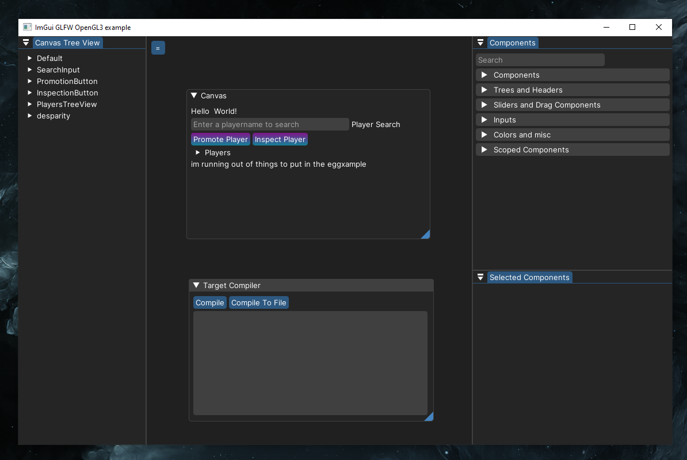

Hi! My name is Adrian or my online nickname Remi and I am a 3rd year university student at the Johannes Gutenberg-University Mainz graduating with a bachelor in computer science early next year. I love making software and am passionate about lower level languages. I am applying mainly because I want to learn more zig and also because I saw many devs bring up tigerbeetle on [ziggit](https://ziggit.dev). This is a quick summary of my recent work and motivations for applying. Enjoy!

## Projects
### ImGui Editor
[ImGuiEditor](https://github.com/randomcmd/ImGuiEditor) is a visual editor for [Dear ImGui](https://github.com/ocornut/imgui) to iterate quickly on GUIs. It allows you to drag and drop different widgets on a canvas and export the layout as C++ code. This was mostly a learning project which lead me down a lot of research rabbit holes for lower level languages and UX/UI. It took 7 months to get to a first preview version.

### OpenGL Game Engine:
I read and followed the LearnOpenGL book combining it with tutorials from The Cherno to make a very basic 3D renderer or beginnings of a game engine. This was one of my first low level projects and introduced me to game engines and graphics programming especially shaders!

### Kuromis2:
Me and my friend have a small github organisation mostly for fun where we made a [firmware updater](https://github.com/kuromis-2/finalware) for finalmouse mice when mac/linux versions werent officially supported yet. Allthough it is just an electron app, it was very nice to see this play out since our focus was on quickly supporting those platforms.

### Zig Projects:
I have yet to use zig for a bigger project, but I have a few smaller projects/experiments that I ran, without any of them turning into bigger projects. This internship would be a great opportunity to increase my skills in zig! So far I really enjoy the language

- ImGuiEditor Zig: I have tried implementing several smaller features of ImGuiEditor to see how zig would improve that code

- [Playdate 3D Engine](linktoengine): Me and some of the developers from the Playdate Squad community have worked on a proof of concept 3D game engine in Zig. Playdate by Panic is a handheld embedded console with an open C and Lua SDK for developers to create games. Allthough very basic and never released it showed the viability of zig to write efficient embedded software renderers in a short amount of time due to the ability to use interop with C. The official repository is private, but I have attached a cleaned up version of the [source code](linketoengine)!

    <table>
        <tr>
            <th>
                This is a screen recording of the gameplay
            </th>
            <th>
                Video of the device itself
            </th>
        </tr>
        <tr>
            <td>
                
            </td>
            <td>
                <video src="https://github.com/user-attachments/assets/588c3d78-28bc-48d9-8105-6ad4651a98fa" controls style="max-width: 100%;" autoplay alt="A video of a yellow playdate console playing the cube game"></video>  
            </td>
        </tr>
    </table>

- [Playdate Debug Tools](linktodebugtools): I tried integrating Dear ImGui with the simulator builds of playdate games to provide a better debugging experience. This is a common theme: I want to make something, but then just make dev tools! This worked out greatly but I need to make changes so it builds for linux from windows

- Playdate Demos: Ported a small 2d game to zig to see how game dev feels on zig coming from other languages

### Liquidation Bot:
We are currently working on a web3 high frequency bot that performs liquidations for the Aave protocol (i am so sorry for the buzzwords) which required us to learn and design a robust concurrent system which deals with financial transactions. So far this project is successful and we just got past the first rust rewrite!
